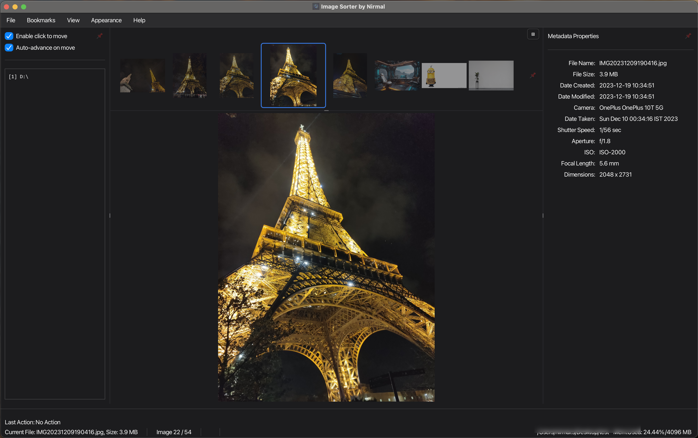
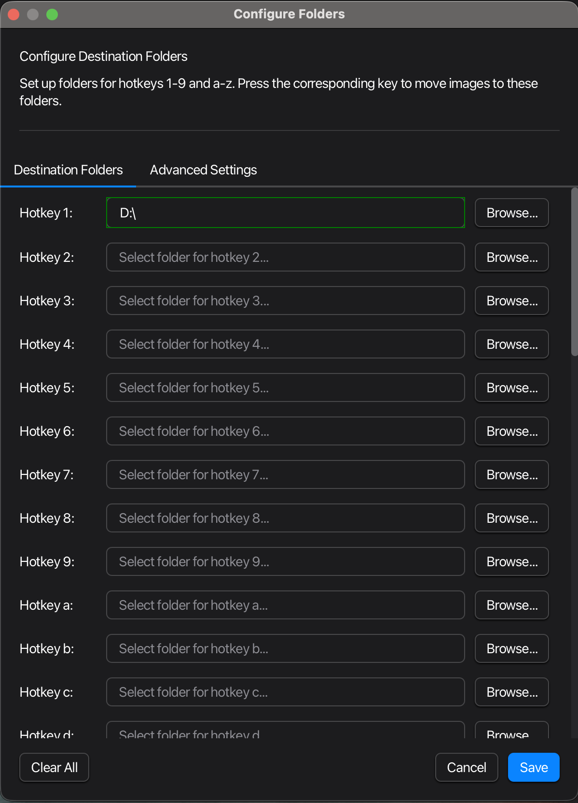
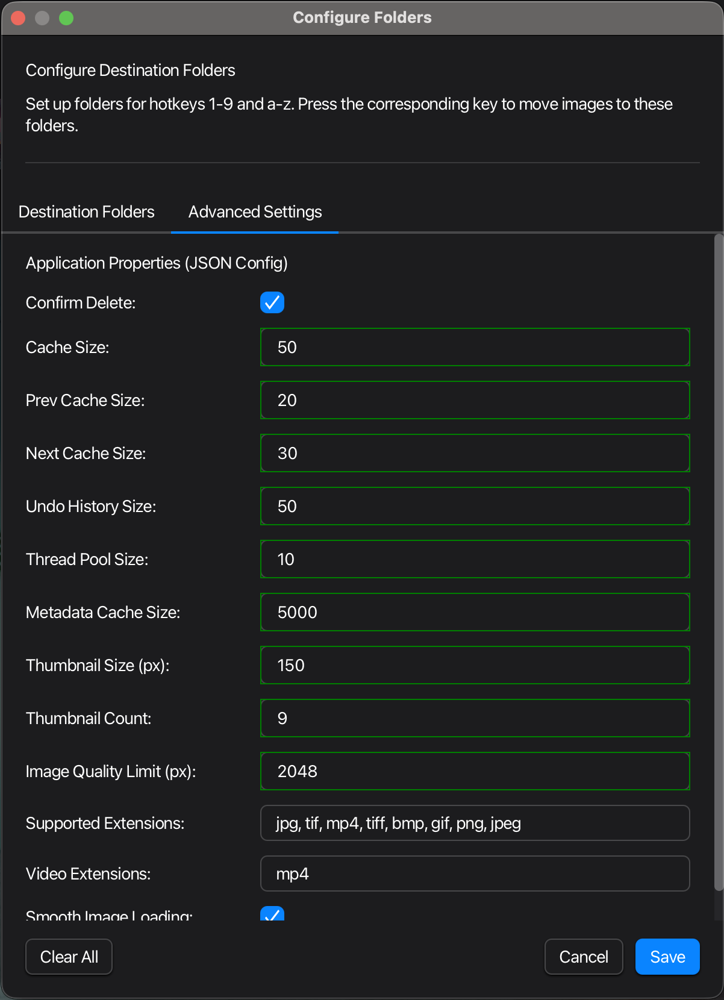
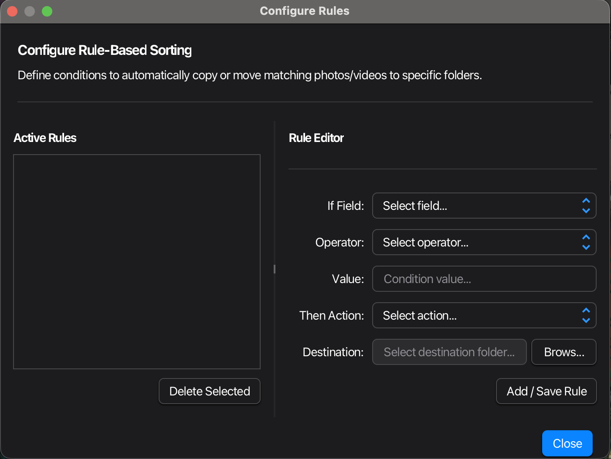

# ImageSorterPro

ImageSorterPro is a lightweight, cross-platform photo culling application built with JavaFX. Designed for photographers who need to rapidly review and cull large photo shoots, it lets you move through your images at speed — rejecting, keeping, and routing shots to labelled folders using nothing but keyboard hotkeys.

## Features

*   **Image & Video Preview:** Large, full-resolution preview of photos and video clips for accurate culling decisions.
*   **Hotkey-based Culling:** Assign destination folders to hotkeys (1–9, a–z) — one keystroke sends the current photo to its category and advances to the next.
*   **Click-to-Advance:** Optionally advance through photos by clicking the left or right side of the preview pane, keeping your hand off the keyboard.
*   **Configurable Cull Destinations:** Set up keep, reject, and rated folders once through the configuration dialog; reuse them across every session.
*   **Non-destructive Reject with Undo:** Rejected photos are moved to a configurable trash folder rather than permanently deleted. Undo any of the last 50 cull actions with `Ctrl+Z`.
*   **Navigation:** Step forward and backward through your shoot with arrow keys, mouse clicks, or scroll wheel.
*   **EXIF Orientation Support:** Automatically corrects image rotation so you always see the photo the right way up.
*   **Memory-Efficient Caching:** Pre-caches adjacent images for instant display — no waiting between shots even in large batches.
*   **Cross-Platform:** Runs on Windows, macOS, and Linux.
*   **Adjustable Layout:** Drag the SplitPane dividers to resize the thumbnail strip, preview, and metadata panels to suit your screen.
*   **Workspace Bookmarks:** Bookmark shoot folders and reload them instantly from the Bookmarks menu.
*   **Action Modes:** Choose how each hotkey action is applied via View → Action Mode:
    *   *Move Directly*: Immediately moves the file to the destination folder.
    *   *Copy Directly*: Immediately copies the file, leaving the original in place.
    *   *Stage Move (Batch)*: Queues the move so you can review and commit the whole batch at once.
    *   *Stage Copy (Batch)*: Queues the copy for batch commit.
*   **Batch Staging Controls:** The status bar shows the number of queued actions and lets you commit or discard the staged batch in one click.
*   **Slideshow / Auto-advance Mode:** Step through a shoot automatically (F5) at intervals of 1 s, 2 s, 3 s, 5 s, or 10 s — useful for a first-pass cull or client review.
*   **Immersive Full-Screen Mode (F11):**
    *   Hides the thumbnail strip, left panel, and metadata panel for a distraction-free culling view.
    *   *Hover Reveal & Auto-hide*: Move the mouse to a screen edge to temporarily reveal the corresponding panel; move away to hide it again.
    *   *Panel Pinning*: Pin any panel with the `📌` button to keep it visible permanently during full-screen culling.
*   **Rule-Based Auto-culling:** Define conditional rules (e.g. ISO > 3200 → move to "Noisy" folder) to automatically route photos matching specific EXIF criteria without touching a hotkey.

## Screenshots

### Main Application Window

The main window provides a large image/video preview, a thumbnail strip at the top for shoot overview, a metadata panel on the right showing EXIF data, and a status bar with current file info and memory usage.



### Configure Folders — Cull Destinations

The Destination Folders tab lets you map a folder path to each hotkey (1–9, a–z). While culling, press the corresponding key to instantly send the current photo to that folder and advance to the next.



### Configure Folders — Advanced Settings

The Advanced Settings tab exposes the full JSON config: cache sizes, thumbnail dimensions, supported file extensions, thread pool size, and other performance-tuning options.



### Configure Rules — Automated Culling Rules

The Configure Rules dialog lets you define conditional culling rules. Each rule specifies an If Field / Operator / Value condition and a Then Action (copy or move) to a chosen folder — automating first-pass culls based on EXIF metadata without manual hotkeys.



## System Requirements

- Java 11 or higher
- JavaFX 11 or higher
- Windows, macOS, or Linux
- Minimum 4 GB RAM recommended
- 100 MB free disk space

## How to Use

### 1. Open a Shoot Folder

Click **File → Open Folder…** or press `Ctrl+O` to select the folder containing your photos.

### 2. Configure Cull Destinations

Click **File → Configure Folders…** or press `Ctrl+P`.

*   Assign a destination folder to each hotkey (1–9, a–z) — for example: `1` = Keep, `2` = Reject, `3` = Edit Later.
*   Set a **Trash Folder** for photos you reject with the `Delete` key.
*   Click **Save**.

### 3. Cull Your Photos

*   **Hotkey cull:** Press a hotkey (1–9, a–z) to move the photo to its assigned folder and advance automatically.
*   **Reject:** Press `Delete` to send the current photo to the Trash Folder.
*   **Archive:** Press `0` (zero) to move the photo to an Archive subfolder inside the current shoot directory.
*   **Navigate:** `Right Arrow` / `Left Arrow` to step through the shoot without culling.
*   **Click-to-Advance:** If *Enable click to move* is checked, click the right half of the preview to advance and the left half to go back.
*   **Undo:** Press `Ctrl+Z` to reverse the last cull action. Up to 50 actions can be undone.

## Building from Source

ImageSorterPro is a Maven project.

### Prerequisites

*   Java Development Kit (JDK) 11 or higher
*   Maven (bundled with most IDEs, or install separately)
*   JavaFX SDK — download from [Gluon](https://gluonhq.com/products/javafx/)

### Steps

1.  **Clone the repository:**
    ```bash
    git clone https://github.com/your-username/ImageSorterPro.git
    cd ImageSorterPro
    ```
2.  **Build the project:**
    ```bash
    ./mvnw clean install
    ```
    Compiles the source, runs tests, and packages the application into a JAR in the `target/` directory.

## Running the Application

```bash
java -Xms1G -Xmx1G -jar --module-path "/path/to/javafx-sdk/lib" --add-modules javafx.controls,javafx.fxml,javafx.swing,javafx.media ImageSorterPro-1.0-SNAPSHOT.jar
```

Or use the wrapper scripts:

*   **Windows:** `mvnw.cmd javafx:run`
*   **Linux/macOS:** `./mvnw javafx:run`

## Troubleshooting

### JavaFX Runtime Not Found
```
Error: JavaFX runtime components are missing
```
**Solution:** Add JavaFX modules to your VM options:
```
--module-path "C:\javafx-sdk-21\lib" --add-modules javafx.controls,javafx.fxml
```

### Images Not Loading
- Check file permissions on the shoot folder
- Ensure the format is in the supported extensions list (jpg, tif, png, gif, bmp, jpeg)
- Verify sufficient disk space

### Performance Issues
- Reduce cache sizes in Advanced Settings
- Close other memory-intensive applications
- Check available system memory

## Contributing

Feel free to fork the repository, make improvements, and submit pull requests.

## License

This project is licensed under the MIT License — see the `LICENSE` file for details.
